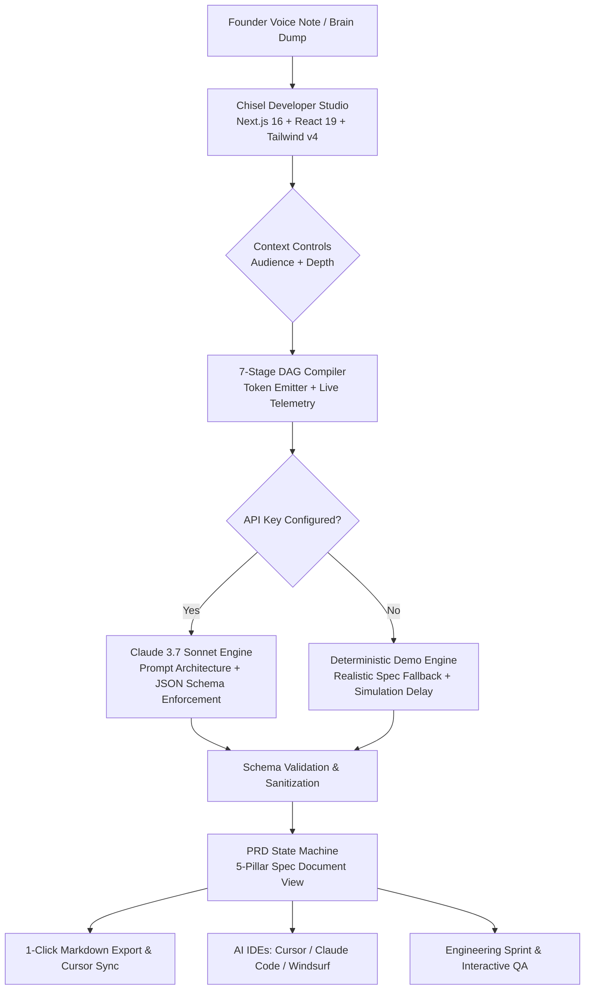

# ⌁ Chisel — Sculpt Rough Ideas into Production-Ready Specs

[](https://founder-brief-omega.vercel.app)
[](https://nextjs.org/)
[](https://react.dev/)
[](https://tailwindcss.com/)
[](https://www.anthropic.com/)
[](https://www.typescriptlang.org/)

> **Chisel** is an AI-powered developer tool that takes messy founder voice notes, audio transcripts, and rapid brain dumps and sculpts them into complete, production-ready Product Requirement Documents (PRDs) — including user stories, REST API specifications, UI component trees, and acceptance criteria.

🔗 **Live Deployment:** [https://founder-brief-omega.vercel.app](https://founder-brief-omega.vercel.app)  
📖 **Architecture & Interview Guide:** [`docs/INTERVIEW_PITCH_AND_ARCHITECTURE.md`](docs/INTERVIEW_PITCH_AND_ARCHITECTURE.md)

---

## ⚡ The Problem: The Founder–Engineer Bottleneck

Early-stage founders, product managers, and builders often have crystal-clear mental models of features, but their thoughts live in unstructured formats:
- 🎙️ 2:00 AM voice note transcriptions
- 📝 Bulleted braindumps filled with jargon and shorthand
- 💬 Scrambled WhatsApp/Slack threads

Engineers and AI agents (Cursor, Claude Code, GitHub Copilot) need **deterministic, structured technical constraints** — user stories, database schemas, API contracts, and edge cases. 

Translating rough vision into engineering specs typically takes **hours or days of meetings**. **Chisel does it in under 3 seconds.**

---

## ✨ Features

- **🎙️ Raw Transcription Ingestion:** Paste audio transcripts from Otter.ai, Whisper, Apple Voice Memos, or rough bullet points with real-time token estimation.
- **⚡ Curated Architecture Presets:** 1-click loading for AST-based PR triage, metered Stripe billing, or a high-throughput Rust vector engine.
- **🎛️ Context & Audience Tuning:**
  - **Audience:** *Solo Dev / AI Coder* (lean & code-focused), *Agency / Freelancers* (milestones & contracts), or *Seed Pitch* (product-led & moats).
  - **Tone & Depth:** *Technical & Lean* vs. *Comprehensive & Enterprise-Ready*.
- **⚡ 7-Stage DAG Compilation Pipeline:** Real-time multi-stage graph visualization showing transcript normalization, entity extraction, invariant parsing, DDL synthesis, and NFR compilation with streaming hardware telemetry (tok/sec, latency, memory).
- **🏛️ 5-Pillar Spec Architecture:**
  1. **Executive Scope & Quantitative Target Bento:** Problem statement, SLA metric cards, and explicit In-Scope vs Out-of-Scope boundaries.
  2. **Gherkin User Stories & Interactive QA Matrix:** Formatted in industry-standard Gherkin syntax (`Given / When / Then`) with reactive test verification checkboxes.
  3. **REST API, TypeScript & PostgreSQL DDL:** Typed HTTP endpoints, syntax-highlighted `schema.ts`, and production-ready `CREATE TABLE` and `CREATE INDEX` migration scripts.
  4. **Frontend Component Hierarchy & Live Sandbox:** ASCII component trees paired with interactive, functional React mock widgets (`Authorize Check` button with state transitions).
  5. **Edge Cases, SLAs & Sign-Off Ledger:** Rate limiting, binary diff bypass, dead-letter queues, and a tamper-evident cryptographic sign-off SHA.
- **🔄 Dual-Engine Architecture (Zero-Key Demo + Claude Live):**
  - **Demo Mode (Zero-Config):** Works out of the box with zero environment variables or API keys. Uses realistic deterministic generation with simulated streaming delay.
  - **Live Mode:** Seamlessly connects to `claude-3-7-sonnet` whenever an `ANTHROPIC_API_KEY` is provided.
- **📋 Developer-First Export:**
  - **Copy Markdown:** Copy individual sections or the entire PRD to clipboard.
  - **Export for Cursor / Claude Code:** Instantly formats specs as `.cursorrules` or `specs/feature.md` system prompts.
  - **Download `.md`:** Instant export of structured `.md` files.
- **🎨 Obsidian Dark-Mode Studio UI:** Linear/Datadog-grade dark obsidian shell, Geist and Geist Mono typography, Material Symbols iconography, micro-animations, and responsive layout constraints.

---

## 🏗️ Architecture & Flow



---

## 🛠️ Tech Stack

| Domain | Technology | Purpose |
| :--- | :--- | :--- |
| **Framework** | [Next.js 16.3.4 (App Router)](https://nextjs.org/) | Serverless API routes, React Server Components, fast edge execution |
| **UI Library** | [React 19](https://react.dev/) | Client-side reactive state machine, interactive sandboxes, and verification checkboxes |
| **Styling** | [Tailwind CSS v4](https://tailwindcss.com/) | Modern `@theme` tokens, glassmorphic obsidian palette, responsive grid |
| **LLM Provider** | [Anthropic Claude 3.7 Sonnet](https://www.anthropic.com/) | High-precision prompt following, systems architecture, and JSON generation |
| **SDK** | `@anthropic-ai/sdk` | Official TypeScript SDK for Anthropic APIs |
| **Typography** | Geist & Geist Mono | Vercel's high-density developer font family |
| **Icons** | Material Symbols Outlined | Standardized engineering iconography |
| **Deployment** | [Vercel](https://vercel.com/) | Instant edge hosting, zero-maintenance CI/CD |

---

## 📁 Repository Structure

```
chisel/
├── app/
│   ├── api/
│   │   └── generate-prd/
│   │       └── route.ts          # Serverless route handler (Claude 3.7 Sonnet + Demo mode)
│   ├── globals.css               # Tailwind v4 @theme tokens, obsidian palette, typography
│   ├── layout.tsx                # App root layout, SEO metadata, Geist & Material Symbols
│   └── page.tsx                  # Main studio orchestrator (editor -> compiling -> document)
├── components/
│   ├── Header.tsx                # Fixed studio header with live engine telemetry & status
│   ├── Sidebar.tsx               # Fixed navigation sidebar with active specs & token meters
│   ├── IdeaEditor.tsx            # Monospace input canvas, sample pills, audience/depth tuning
│   ├── CompilingView.tsx         # 7-stage DAG execution graph, token emitter, hardware telemetry
│   ├── SpecDocumentView.tsx      # 5-pillar technical specification view with interactive sandbox
│   ├── HeroSection.tsx           # Legacy hero presentation component
│   ├── InputPanel.tsx            # Legacy input panel component
│   └── PRDOutput.tsx             # Legacy PRD output component
├── lib/
│   ├── mock-prd.ts               # Standalone fallback PRD for demo mode
│   └── prompts.ts                # System prompt engineering & JSON schema guidelines
├── types/
│   └── prd.ts                    # Strict TypeScript interfaces for PRD structures
├── public/                       # Static public assets & icons
├── package.json                  # Dependencies & scripts
└── tsconfig.json                 # Strict TypeScript configuration
```

---

## 🚀 Getting Started

### Prerequisites
- Node.js 18.17+ or later
- npm, yarn, or pnpm

### 1. Clone the Repository
```bash
git clone https://github.com/Atharvabagul84/Chisel.git
cd Chisel
```

### 2. Install Dependencies
```bash
npm install
```

### 3. (Optional) Configure Claude API Key
> **Note:** Chisel includes an automated **Demo Mode**. If no API key is supplied, the app runs perfectly using realistic simulated generation.

To use live Claude 3.5 Sonnet generation, create a `.env.local` file in the root directory:
```bash
cp .env.example .env.local
```
Add your Anthropic API key:
```env
ANTHROPIC_API_KEY=sk-ant-api03-...
```

### 4. Run the Development Server
```bash
npm run dev
```
Open [http://localhost:3000](http://localhost:3000) in your browser.

### 5. Build for Production
```bash
npm run build
npm run start
```

---

## 🧠 Prompt Engineering Philosophy

The core intelligence behind Chisel is encapsulated in [`lib/prompts.ts`](lib/prompts.ts):
- **Principal Architect Persona:** Claude is instructed to act as a Principal Software Architect who refuses generic fluff and demands technical precision.
- **Strict JSON Contract:** Uses negative prompting to eliminate preamble, markdown wrapping (` ```json `), or commentary, ensuring 100% reliable programmatic parsing.
- **Gherkin User Story Formatting:** Every user story must adhere to `Given/When/Then` acceptance criteria so engineering teams can immediately write automated tests.
- **Actionable API Design:** Endpoints require explicit HTTP verbs, path variables, query parameters, request bodies, and expected status codes.

---

## 💡 How to Use the Output with AI IDEs (Cursor, Claude Code, Windsurf)

1. Paste your voice note or idea into **Chisel**.
2. Click **"Download .md"** or **"Copy Markdown"**.
3. Save the file into your repo as `specs/feature-prd.md`.
4. In **Cursor** or **Claude Code**, prompt:
   ```markdown
   @specs/feature-prd.md Implement the REST API endpoints described in Section 3, 
   following the user stories in Section 2.
   ```
5. Build features in hours instead of days.

---


---

## 📄 License

This project is licensed under the [MIT License](LICENSE).
